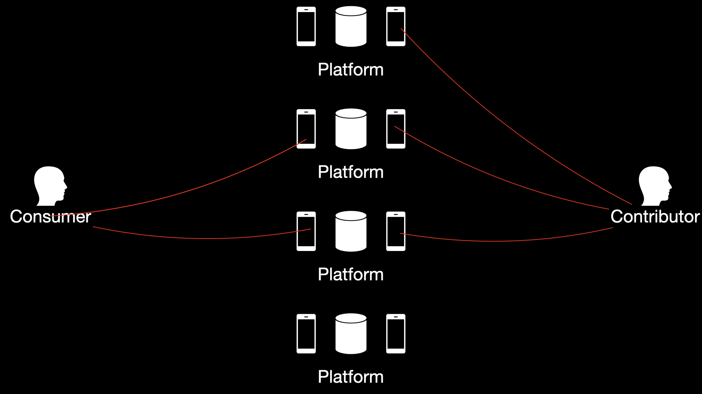
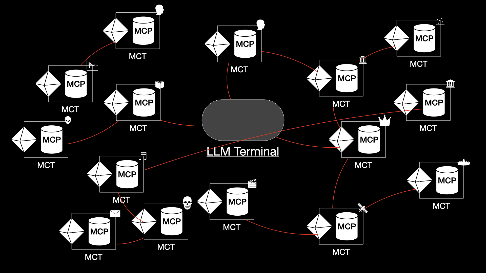

# Introduction

## Introduction to Model Context Token (MCT)

In the emerging era of AI and autonomous agents, we propose the **Model Context Token (MCT)** as a  token protocol designed for seamless integration between Web3 assets and AI-powered agents. Inspired by the [Model Context Protocol (MCP)](https://modelcontextprotocol.io/introduction), MCT aims to become the foundational format for interacting with decentralized digital objects in a future driven by machine agents rather than human users.

We believe agents will increasingly manage online tasks—from negotiation to communication—on behalf of users. This is not a technical specification, but an open concept introduction and discussion thread. We welcome contributions, feedback, and community participation via GitHub.

***

## What is an MCT?

A **Model Context Token (MCT)** is a tokenized object designed to interface with AI agents in a decentralized web. Any fungible token can be classified as an MCT if it meets the following conditions:

* It is **a standard fungible token** (SPL/ERC-20), enabling ownership, authentication, and economy.
* It embeds its **raw prompt** or context metadata on-chain, describing its purpose or representation. This is enable discovery.
* It links to an **MCP-compatible server endpoint** (also on-chain), which tells AI agents how to interact with the token.

***

## Why MCT?

The [MCP](https://modelcontextprotocol.io/introduction) has the potential to play a similar role in the AI age as HTTP did in the early internet—providing a structured interface for agent communication. Large Language Models (LLMs) continue to advance rapidly, and their capacity to interpret, reason, and act is still underestimated.

In the future, we foresee agents becoming the primary interface for digital interactions. Users will simply specify their intent; agents will handle execution—negotiation, search, decision-making.

However, Web2-based implementations of MCP face barriers due to data ownership, privacy concerns, and lack of incentive for openness. Web3, by contrast, offers:

* **Permissionless infrastructure**
* **On-chain ownership and authenticity**
* **Native payment and incentive mechanisms**

MCT combines the benefits of Web3 with the semantic power of MCP, enabling programmable, interactive tokens. It is particularly well-suited to environments where agent-to-agent negotiation, personalization, and automation are key.

***

## The Ultimate Web3 Format in the Agent Era

<figure><figcaption>
Web Now
</figcaption></figure>

In this future, websites, apps, and platforms may become obsolete. Instead, a vast ocean of MCTs will represent every individual, organization, product, and idea. Interaction will be driven entirely by AI agents communicating via MCP.

Each person or entity may hold one or more MCTs, which serve as their digital interface. All interaction—commercial, social, informational—will flow through these context-rich tokens.

<figure><figcaption>
Web Future
</figcaption></figure>

***

## Potential Use Cases for MCT

> No one goes to StackOverflow today. That will apply to all websites and apps in 5 years.

Below are exploratory directions where MCTs could play a significant role. These are not fully developed product ideas but rough conceptual paths:

### Online Advertising

Today’s online ads rely on centralized platforms (e.g., Google, Meta) that own customer data and deploy proprietary ML models.

With MCT, each user can publish their preferences and behavior to their own MCP server. Advertisers can query these MCTs directly (with payment), removing the need for intermediaries.\
\
This will be extremely economic for small business owners.

### Content Distribution

> Recommendation algorithms will no longer be required.

Content creators can publish MCTs with metadata and interaction interfaces. Interested parties—via their own agents—can discover, negotiate, and transact directly based on semantic relevance, without platforms. The middle-man recommendation engine will disappear as LLM can understand the interests enough.\
\
No matter what kind of content creators you are: video creators, journalists, book authors... You can get rid of the middle player and talk directly and of course, collect revenue directly from your target audiences.

### Information economy

> I'm not uncertain.

In an emerging _information economy_ powered by MCTs, valuable real-time insights from frontline sources can be tokenized and monetized directly.&#x20;

Consider the '[Chikentown](https://www.imdb.com/title/tt9141488/)' in _Billions_, where a hedge fund profits from insider knowledge provided by a local chicken industry reporter. In a decentralized MCT framework, this informant could instead issue an a MCT and run an MCP server, broadcasting supply chain anomalies as structured data, legally and transparently. Hedge funds, logistics platforms, or commodity traders could subscribe to or purchase this information.&#x20;

Similarly, a car rental employee observing a regional surge in vehicle demand, or a factory line worker witnessing a critical slowdown in output, could tokenize such observations.

&#x20;These real-world **“human sensors”** become micro-data providers in a live, permissionless data economy—bypassing traditional bottlenecks and enabling a more equitable, ground-up flow of market-relevant intelligence.

### Social Networks

> Let your MCT talk to my MCT.

Users' agents can connect and interact by accessing each other's MCTs. Social interaction becomes agent-mediated, context-aware, and programmable.

### International Trade

Instead of manually browsing marketplaces (e.g., Alibaba), imagine every supplier in China has a public MCT. Entrepreneurs can instruct agents to source, negotiate, and contract directly with supplier agents through MCTs.

***

## Challenges and Opportunities

### Decentralized MCT Discovery

How do you verify the authentic MCT of an individual or organization?

* Personal contacts (friends, family) are easy.
* But what about public figures or trade partners?

This introduces the need for decentralized registries or verification protocols—a "MCT of MCTs"—without recreating centralized gatekeepers.

### Local MCP Servers

> We may need LocalMCP for everyone before LocalLLM for everyone

For MCTs to succeed, individuals must be able to host personal MCP servers effortlessly.

Rather than manually inputting data, imagine:

* Phones or laptops running lightweight MCP servers by default.
* Local data generation (e.g., browsing, documents, messages) structured and shared securely.

Such accessibility will accelerate MCT adoption significantly.

***

## Core Concepts

### Token

A fungible token is basically a [cryptocurrencies](https://en.wikipedia.org/wiki/Cryptocurrency).

### MCP (Model Context Protocol)

The **Model Context Protocol** defines how agents interact with structured digital content using context-rich prompts. Learn more at [modelcontextprotocol.io](https://modelcontextprotocol.io/introduction).

### AI Agents

**AI Agents** are software systems capable of reasoning, planning, and acting autonomously on behalf of users. They are at the core of the agentic internet. Learn more [here](https://cloud.google.com/discover/what-are-ai-agents).

***

## Contribute and Discuss

Model Context Token is a community-driven concept at the intersection of AI, Web3, and programmable interfaces. Join the discussion, contribute ideas, or help prototype tools and standards via our GitHub repository.

Also, you can join the discussion on our official X handle: [**@open\_mct**](https://x.com/OPEN_MCT)
